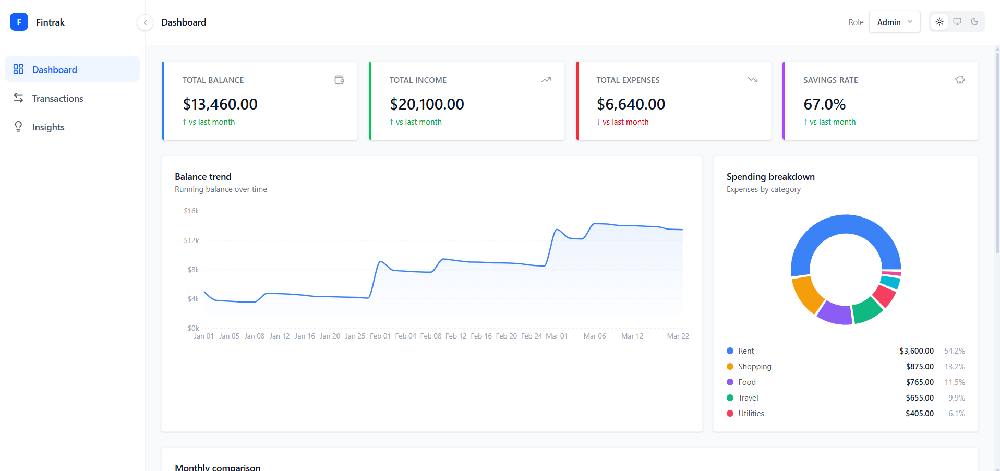
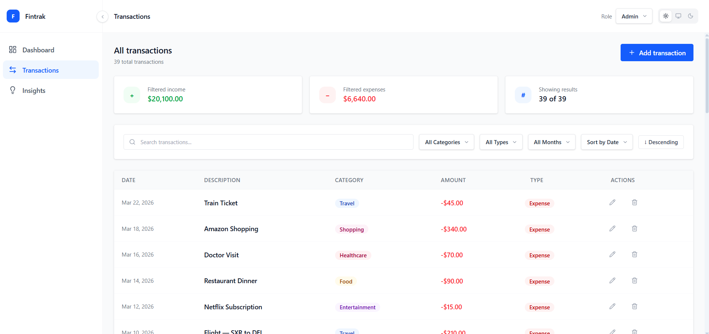
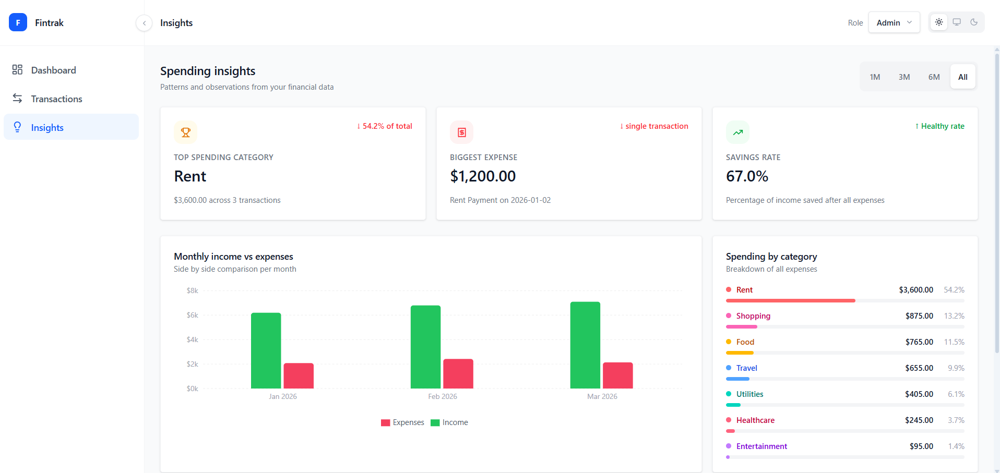

# Fintrak - Personal Finance Dashboard

A feature-rich personal finance dashboard built with React, TypeScript, and Redux Toolkit. Fintrak helps users track transactions, understand spending patterns, and visualize financial activity through an intuitive and responsive interface.

---

## Live Demo

> Run locally with `npm run dev`

---

## Screenshots

| Dashboard                                    | Transactions                                       | Insights                                   |
| -------------------------------------------- | -------------------------------------------------- | ------------------------------------------ |
|  |  |  |

---

## Features

### Core Features

**Dashboard Overview**

- Summary cards showing Total Balance, Income, Expenses, and Savings Rate.
- Balance trend area chart showing running balance over time.
- Spending breakdown donut chart with category legend.
- Monthly income vs expenses comparison bar chart.
- Recent transactions preview table.

**Transactions Management**

- Full transactions table with date, description, category, amount, and type.
- Search filtering by description.
- Dynamic month filter, derived from actual transaction data, updates automatically when new months are added.
- Filter by category and transaction type.
- Sort by date or amount in ascending or descending order.
- Add, edit, and delete transactions with loading states and confirmation dialogs.
- Form validation with inline error messages.

**Insights**

- Top spending category with percentage of total.
- Biggest single expense callout.
- Savings rate with health indicator.
- Month over month spending comparison.
- Recurring transaction detection.
- Most active month analysis.
- Savings health observation with personalized advice.
- Period filter: 1M, 3M, 6M, All, filters all insight data dynamically.

**Role Based UI**

- Admin role - full access to add, edit, and delete transactions.
- Viewer role - read only access, all action buttons hidden from DOM.

### UX Features

**Dark Mode - Three State**

- Light, Dark, and System modes.
- System mode follows OS preference in real time.
- Persists to localStorage across sessions.

**Skeleton Loaders**

- Stat cards, charts, tables, and insight cards have dedicated skeletons
- Shown during initial data fetch from mock API

**Mobile Responsive**

- Sidebar collapses to a slide-over drawer on mobile.
- All pages adapt gracefully to different viewports.

**Date Picker**

- Custom styled react-datepicker replacing native date input because the native date picker renders inconsistently across browsers and cannot be positioned properly.
- Fully styled to match light and dark themes.

**Empty States**

- Every chart, table, and list has a meaningful empty state.

**Scrollbar Styling**

- Custom slim scrollbar in both light and dark themes.
- Defined via CSS variables using Tailwind color tokens.

---

## Tech Stack

| Concern     | Choice                   | Reason                                          |
| ----------- | ------------------------ | ----------------------------------------------- |
| Framework   | React 19 + Vite          | Fast, modern, industry standard                 |
| Language    | TypeScript — strict mode | Full type safety                                |
| Styling     | Tailwind CSS v4          | Utility-first, clean design system              |
| State       | Redux Toolkit            | Production standard, clear slice architecture   |
| Routing     | React Router v6          | File-based routing with nested layouts          |
| Charts      | Recharts                 | React-native, composable, typed                 |
| Date Picker | react-datepicker         | Built-in popper positioning, fully customizable |
| Icons       | Lucide React             | Consistent, fully typed icon set                |
| Date Utils  | date-fns                 | Lightweight, tree-shakeable                     |
| IDs         | uuid                     | Collision-safe transaction IDs                  |

## Project Structure

### Feature-Based Co-location

The project follows a feature-based architecture where each page owns its components, hooks, utils, and constants. If a component, hook, or utility is only used in one page it lives inside that page's folder. Only when something is genuinely needed across two or more pages does it get promoted to the root level. This makes the codebase navigable by feature rather than by file type.

### Naming Conventions

Every non-component file uses a suffix that describes its role — `*.utils.ts`, `*.hook.ts`, `*.slice.ts`, `*.thunk.ts`, `*.constants.ts`, `*.types.ts`. This makes the file type immediately clear from the filename without opening it.

### Utility Class Pattern

All utility functions are organized into static classes rather than loose exported functions - `FormatUtils`, `CalculationUtils`, `TransactionUtils`, `InsightUtils`, `ThemeUtils`. This groups related functions under a meaningful namespace, makes call sites self-documenting.

---

## Architecture Decisions

### Feature-Based Structure

Pages own their components, hooks, and utils. Only components used across multiple pages are promoted to the root `components/` directory. This makes the codebase navigable easily.

### Mock API with localStorage Persistence

Transactions are persisted to `localStorage` via the mock API layer, not directly in Redux. The API reads from storage on fetch, and writes back on every mutation. Redux stays clean and only holds in-memory state.

### Three-State Theme System

Theme can be `light`, `dark`, or `system`. The `system` option follows OS preference in real time via a `matchMedia` listener. Theme is stored to `localStorage` and applied via an inline script in `index.html` before React renders, eliminating the white flash entirely.

### Path Aliases

All imports use `@fintrack/*` aliases, no relative path climbing:

```ts
import { Button } from "@fintrack/components";
import { FormatUtils } from "@fintrack/utils";
import { fetchTransactions } from "@fintrack/store";
```

---

## State Management

### Redux for Global, useState for Local

The app uses Redux Toolkit for state that is genuinely global, the transactions list, active filters, current role, theme, and sidebar state. Anything that is purely a local UI concern stays in component-level `useState`.

### Async State with Mutation Tracking

The transactions slice tracks loading and error state independently for each operation - fetch, add, update, and delete each have their own status. Async thunks are separated into their own file from the slice to keep each file focused on one responsibility.

## Code Quality

### TypeScript - Strict Mode

The project runs TypeScript with the strictest possible compiler settings. `strict: true` enables the full suite of type checks including `strictNullChecks`, `strictFunctionTypes`, and `noImplicitAny`. On top of that, `noUnusedLocals` and `noUnusedParameters` prevent dead code from accumulating silently.

### ESLint

The project uses ESLint with `typescript-eslint` for static analysis beyond what the TypeScript compiler catches. Rules enforce React hooks dependency arrays via `eslint-plugin-react-hooks` and prevent stale component renders via `eslint-plugin-react-refresh`. Linting runs as part of the build pipeline - the build fails if there are any lint errors, ensuring code quality is enforced completely.

### Path Aliases

All internal imports use `@fintrack/*` aliases configured in both `tsconfig.app.json` and `vite.config.ts`. This eliminates relative path climbing like `../../../components` and makes imports self-documenting. TypeScript resolves the aliases for type checking and Vite resolves them at build time, both stay in sync through a single source of truth in the config files.
